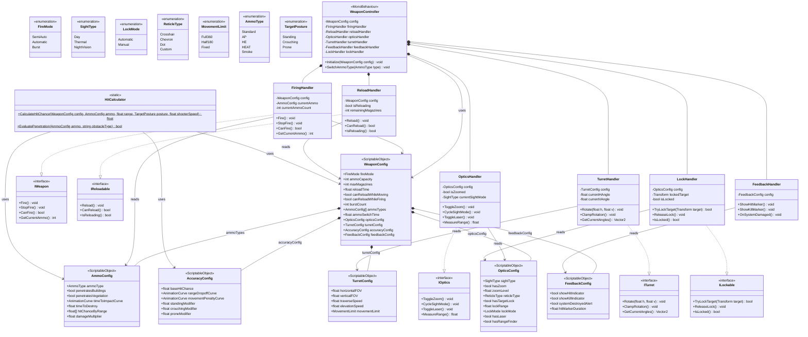

```mermaid
classDiagram
    direction TB

    class FireMode {
        <<enumeration>>
        SemiAuto
        Automatic
        Burst
    }

    class SightType {
        <<enumeration>>
        Day
        Thermal
        NightVision
    }

    class LockMode {
        <<enumeration>>
        Automatic
        Manual
    }

    class ReticleType {
        <<enumeration>>
        Crosshair
        Chevron
        Dot
        Custom
    }

    class MovementLimit {
        <<enumeration>>
        Full360
        Half180
        Fixed
    }

    class AmmoType {
        <<enumeration>>
        Standard
        AP
        HE
        HEAT
        Smoke
    }

    class TargetPosture {
        <<enumeration>>
        Standing
        Crouching
        Prone
    }

    class WeaponConfig {
        <<ScriptableObject>>
        +FireMode fireMode
        +int ammoCapacity
        +int maxMagazines
        +float reloadTime
        +bool canReloadWhileMoving
        +bool canReloadWhileFiring
        +int burstCount
        +AmmoConfig[] ammoTypes
        +float ammoSwitchTime
        +OpticsConfig opticsConfig
        +TurretConfig turretConfig
        +AccuracyConfig accuracyConfig
        +FeedbackConfig feedbackConfig
    }

    class AmmoConfig {
        <<ScriptableObject>>
        +AmmoType ammoType
        +bool penetratesBuildings
        +bool penetratesVegetation
        +AnimationCurve timeToImpactCurve
        +float timeToDestroy
        +float[] hitChanceByRange
        +float damageMultiplier
    }

    class OpticsConfig {
        <<ScriptableObject>>
        +SightType sightType
        +bool hasZoom
        +float zoomLevel
        +ReticleType reticleType
        +bool hasTargetLock
        +float lockRange
        +LockMode lockMode
        +bool hasLaser
        +bool hasRangeFinder
    }

    class TurretConfig {
        <<ScriptableObject>>
        +float horizontalFOV
        +float verticalFOV
        +float traverseSpeed
        +float elevationSpeed
        +MovementLimit movementLimit
    }

    class AccuracyConfig {
        <<ScriptableObject>>
        +float baseHitChance
        +AnimationCurve rangeDropoffCurve
        +AnimationCurve movementPenaltyCurve
        +float standingModifier
        +float crouchingModifier
        +float proneModifier
    }

    class FeedbackConfig {
        <<ScriptableObject>>
        +bool showHitIndicator
        +bool showKillIndicator
        +bool systemDestroyedAlert
        +float hitMarkerDuration
    }

    class IWeapon {
        <<interface>>
        +Fire() void
        +StopFire() void
        +CanFire() bool
        +GetCurrentAmmo() int
    }

    class IReloadable {
        <<interface>>
        +Reload() void
        +CanReload() bool
        +IsReloading() bool
    }

    class IOptics {
        <<interface>>
        +ToggleZoom() void
        +CycleSightMode() void
        +ToggleLaser() void
        +MeasureRange() float
    }

    class ITurret {
        <<interface>>
        +Rotate(float h, float v) void
        +ClampRotation() void
        +GetCurrentAngles() Vector2
    }

    class ILockable {
        <<interface>>
        +TryLockTarget(Transform target) bool
        +ReleaseLock() void
        +IsLocked() bool
    }

    class WeaponController {
        <<MonoBehaviour>>
        -WeaponConfig config
        -FiringHandler firingHandler
        -ReloadHandler reloadHandler
        -OpticsHandler opticsHandler
        -TurretHandler turretHandler
        -FeedbackHandler feedbackHandler
        -LockHandler lockHandler
        +Initialize(WeaponConfig config) void
        +SwitchAmmoType(AmmoType type) void
    }

    class FiringHandler {
        -WeaponConfig config
        -AmmoConfig currentAmmo
        -int currentAmmoCount
        +Fire() void
        +StopFire() void
        +CanFire() bool
        +GetCurrentAmmo() int
    }

    class ReloadHandler {
        -WeaponConfig config
        -bool isReloading
        -int remainingMagazines
        +Reload() void
        +CanReload() bool
        +IsReloading() bool
    }

    class OpticsHandler {
        -OpticsConfig config
        -bool isZoomed
        -SightType currentSightMode
        +ToggleZoom() void
        +CycleSightMode() void
        +ToggleLaser() void
        +MeasureRange() float
    }

    class TurretHandler {
        -TurretConfig config
        -float currentHAngle
        -float currentVAngle
        +Rotate(float h, float v) void
        +ClampRotation() void
        +GetCurrentAngles() Vector2
    }

    class FeedbackHandler {
        -FeedbackConfig config
        +ShowHitMarker() void
        +ShowKillMarker() void
        +OnSystemDamaged() void
    }

    class LockHandler {
        -OpticsConfig config
        -Transform lockedTarget
        -bool isLocked
        +TryLockTarget(Transform target) bool
        +ReleaseLock() void
        +IsLocked() bool
    }

    class HitCalculator {
        <<static>>
        +CalculateHitChance(WeaponConfig config, AmmoConfig ammo, float range, TargetPosture posture, float shooterSpeed)$ float
        +EvaluatePenetration(AmmoConfig ammo, string obstacleType)$ bool
    }

    WeaponConfig *-- AmmoConfig : ammoTypes
    WeaponConfig *-- OpticsConfig : opticsConfig
    WeaponConfig *-- TurretConfig : turretConfig
    WeaponConfig *-- AccuracyConfig : accuracyConfig
    WeaponConfig *-- FeedbackConfig : feedbackConfig

    FiringHandler ..|> IWeapon
    ReloadHandler ..|> IReloadable
    OpticsHandler ..|> IOptics
    TurretHandler ..|> ITurret
    LockHandler ..|> ILockable

    WeaponController *-- FiringHandler
    WeaponController *-- ReloadHandler
    WeaponController *-- OpticsHandler
    WeaponController *-- TurretHandler
    WeaponController *-- FeedbackHandler
    WeaponController *-- LockHandler

    WeaponController --> WeaponConfig : uses

    FiringHandler --> WeaponConfig : reads
    FiringHandler --> AmmoConfig : reads
    ReloadHandler --> WeaponConfig : reads
    OpticsHandler --> OpticsConfig : reads
    TurretHandler --> TurretConfig : reads
    FeedbackHandler --> FeedbackConfig : reads
    LockHandler --> OpticsConfig : reads

    HitCalculator --> WeaponConfig : uses
    HitCalculator --> AmmoConfig : uses
    HitCalculator --> AccuracyConfig : uses
```
